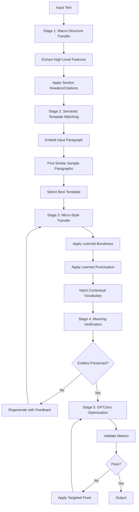
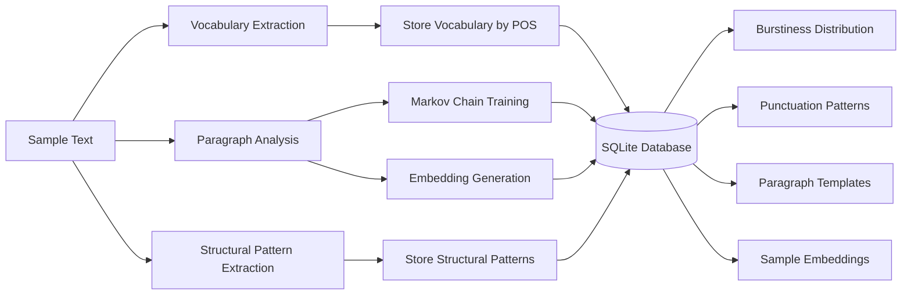
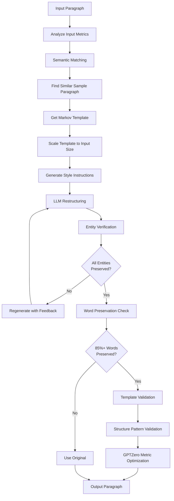
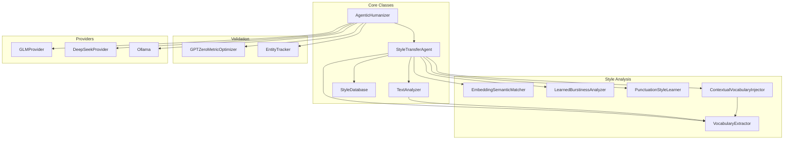

# AI Text Depattern

An agentic text humanization tool that rewrites AI-generated text to sound more natural and human-like using **Multi-Level Style Transfer**. The system learns writing patterns from a human sample and applies them at multiple levels (discourse, paragraph, sentence, word) while preserving all original meaning.

## Approach

AI Text Depattern uses a sophisticated **Few-Shot Style Transfer** approach that operates at multiple linguistic levels:

1. **Macro-Structure Transfer**: Applies high-level patterns (section headers, citations, quotations, rhetorical devices)
2. **Semantic Template Matching**: Uses embeddings to find structurally similar paragraphs from the sample
3. **Micro-Style Transfer**: Restructures sentences to match learned patterns (length, complexity, punctuation)
4. **Vocabulary Injection**: Prefers words from the sample text using contextual semantic matching
5. **Meaning Preservation**: Validates entities, citations, and factual content at each step

## Algorithm Overview



## Architecture

### Training Phase

The system learns style patterns from a human writing sample (`prompts/sample.txt`):



**Training Steps:**
1. **Vocabulary Extraction**: Identifies non-technical words by POS (verbs, nouns, adjectives, adverbs) with frequency counts
2. **Paragraph Analysis**: Analyzes each paragraph for sentence structure, length, complexity, voice (active/passive)
3. **Markov Chain Training**: Learns paragraph-to-paragraph transitions and stores templates
4. **Embedding Generation**: Creates semantic embeddings for each sample paragraph (using sentence-transformers)
5. **Pattern Learning**: Extracts burstiness distribution, punctuation frequencies, and structural patterns

### Generation Phase

For each input paragraph, the system:



**Key Components:**

1. **Semantic Template Matching**
   - Embeds input paragraph using sentence-transformers
   - Finds top 3 most similar sample paragraphs by cosine similarity
   - Selects template that best matches both semantic content and Markov chain state

2. **Template Generation**
   - Extracts sentence structure from matched sample paragraph
   - Scales template to match input content length
   - Includes learned burstiness distribution and punctuation patterns
   - Provides preferred vocabulary suggestions

3. **LLM Restructuring**
   - Uses structural editor prompt to guide restructuring
   - Emphasizes word preservation (85%+ threshold)
   - Applies learned patterns (sentence lengths, POS ratios, punctuation)

4. **Validation Layers**
   - **Entity Verification**: Ensures all named entities, proper nouns, and citations preserved
   - **Word Preservation**: Validates 85%+ word overlap (prevents paraphrasing)
   - **Template Validation**: Checks sentence count and lengths match template
   - **Structure Validation**: Compares punctuation, sentence openers, clause structure to sample
   - **GPTZero Optimization**: Ensures sentence-length variance >30, unique-starter ratio >40%

## System Components



## Prerequisites

1. **Python 3.8+**
2. **Model Provider** (choose one):
   - **Ollama**: Install and run locally with these models:
     ```bash
     ollama pull qwen3:32b
     ollama pull deepseek-r1:8b
     ollama serve
     ```
   - **GLM (Z.AI)**: Get API key from [Z.AI](https://z.ai) and configure in `config.json`
   - **DeepSeek**: Get API key from [DeepSeek](https://platform.deepseek.com) and configure in `config.json`

## Setup

1. **Create and activate virtual environment**:
   ```bash
   python3 -m venv venv
   source venv/bin/activate  # bash/zsh
   # or: source venv/bin/activate.fish  # fish
   # or: venv\Scripts\Activate.ps1  # Windows PowerShell
   ```

2. **Install dependencies**:
   ```bash
   pip install -r requirements.txt
   ```
   Note: First run downloads GPT-2 Large (~3GB) for perplexity scoring.

3. **Configure models** (optional):
   Edit `config.json` to choose provider and models:
   - Set `"provider"` to `"ollama"`, `"glm"`, or `"deepseek"`
   - For GLM: Set `glm.api_key` or use `GLM_API_KEY` environment variable
   - For DeepSeek: Set `deepseek.api_key` or use `DEEPSEEK_API_KEY` environment variable

4. **Configure style sample** (optional):
   Edit `prompts/sample.txt` to match your desired writing style.

## Usage

### Command Line

Process a markdown file:
```bash
python humanizer.py input/generated.md
```

Specify output file:
```bash
python humanizer.py input/generated.md output/humanized.md
```

If no output file is specified, it defaults to `output/<input_filename>`.

### Python API

```python
from humanizer import AgenticHumanizer

pipeline = AgenticHumanizer()
text = "Your AI-generated text here..."
result = pipeline.humanize(text, max_retries=3)
print(result)
```

## Configuration

Edit `config.json` to configure:

- **Provider**: Set `"provider"` to `"ollama"`, `"glm"`, or `"deepseek"`
- **Ollama Settings**: Configure `ollama.url`, `ollama.editor_model`, `ollama.critic_model`
- **GLM Settings**: Configure `glm.api_key` (or use `GLM_API_KEY` env var), `glm.editor_model`, `glm.critic_model`
- **DeepSeek Settings**: Configure `deepseek.api_key` (or use `DEEPSEEK_API_KEY` env var), `deepseek.editor_model`, `deepseek.critic_model`

### Sample config.json

```json
{
  "provider": "ollama",
  "ollama": {
    "url": "http://localhost:11434/api/generate",
    "editor_model": "qwen3:32b",
    "critic_model": "deepseek-r1:8b"
  },
  "glm": {
    "api_key": "",
    "api_url": "https://api.z.ai/api/paas/v4/chat/completions",
    "editor_model": "glm-4.6",
    "critic_model": "glm-4.6"
  },
  "deepseek": {
    "api_key": "",
    "api_url": "https://api.deepseek.com/v1/chat/completions",
    "editor_model": "deepseek-chat",
    "critic_model": "deepseek-chat"
  }
}
```

**Note:** For GLM and DeepSeek, you can also set the API key via environment variable:
- `export GLM_API_KEY=your-api-key-here`
- `export DEEPSEEK_API_KEY=your-api-key-here`

## How It Works

### Training Process

On first run, the system automatically trains on `prompts/sample.txt`:

1. **Vocabulary Extraction**: Identifies preferred words by POS category
2. **Burstiness Learning**: Calculates sentence length distribution (short ≤10, medium 11-25, long >25)
3. **Punctuation Learning**: Measures frequency of em-dashes, semicolons, colons, parentheses
4. **Structural Pattern Extraction**: Analyzes headers, citations, quotations, rhetorical devices
5. **Markov Chain Training**: Learns paragraph structure transitions
6. **Embedding Storage**: Creates semantic embeddings for template matching

The trained model is stored in `style_brain.db` (SQLite database).

### Generation Process

For each paragraph:

1. **Semantic Matching**: Finds most similar sample paragraph using embeddings
2. **Template Selection**: Gets Markov chain template based on current state and semantic match
3. **Scaling**: Adjusts template to match input content length
4. **LLM Restructuring**: Uses editor model to restructure text following template
5. **Validation Cascade**:
   - Entity preservation (hard fail if missing)
   - Word preservation (85%+ threshold)
   - Template structure match
   - Style pattern match
   - GPTZero metrics
6. **Retry Logic**: Regenerates with feedback if validation fails

### Key Features

- **Multi-Level Style Transfer**: Operates at discourse, paragraph, sentence, and word levels
- **Semantic Template Matching**: Uses embeddings to find content-relevant templates
- **Learned Patterns**: Burstiness, punctuation, and structural patterns learned from sample
- **Meaning Preservation**: Multiple validation layers ensure factual accuracy
- **GPTZero Evasion**: Directly optimizes metrics used by AI detectors
- **Contextual Vocabulary**: Prefers sample words using semantic similarity

## File Structure

```
ai-text-depattern/
├── humanizer.py          # Main orchestrator class
├── markov.py             # Style transfer agent and analysis
├── glm.py                # GLM API provider
├── deepseek.py           # DeepSeek API provider
├── config.json           # Configuration file
├── style_brain.db        # Trained model database (auto-generated)
├── prompts/
│   ├── sample.txt        # Human writing style sample
│   ├── editor.md         # Structural editor prompt
│   ├── paragraph_rewrite.md  # Paragraph rewriting template
│   └── structural_*.md   # Structural analysis prompts
└── requirements.txt      # Python dependencies
```

## Technical Details

### Database Schema

The SQLite database (`style_brain.db`) stores:

- **states**: Paragraph structure templates with signatures
- **transitions**: Markov chain transitions between paragraph states
- **vocabulary**: Preferred words by POS category with frequencies
- **sample_embeddings**: Semantic embeddings for template matching
- **learned_patterns**: Burstiness, punctuation, and structural patterns
- **structural_patterns**: High-level patterns (headers, citations, etc.)

### Validation Thresholds

- **Word Preservation**: ≥85% word overlap required
- **Entity Preservation**: 100% for named entities and citations
- **Sentence Length Variance**: >30 for GPTZero evasion
- **Unique Starter Ratio**: >40% for GPTZero evasion
- **Style Match Score**: >60% for structure validation

### Model Configuration

- **Temperature**: 0.5-0.6 (stricter adherence to instructions)
- **Top-p**: 0.85 (nucleus sampling)
- **Context Window**: 8192 tokens (Ollama), model-dependent for APIs

## Limitations

- Requires substantial sample text (recommended: 1000+ words) for effective training
- Semantic matching requires `sentence-transformers` (optional, falls back to Markov-only if unavailable)
- Processing time scales with input length (paragraph-by-paragraph processing)
- First run downloads GPT-2 Large model (~3GB) for perplexity scoring

## License

[Add your license here]
