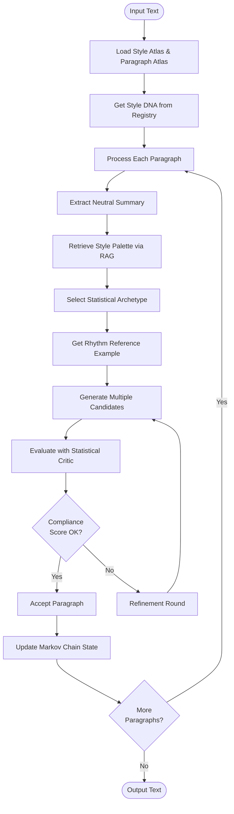

# Text Style Transfer

Transform text to match a target author's style while preserving semantic meaning. Uses a multi-layered architecture with:

- **Style Atlas**: ChromaDB-based vector store for paragraph-level style retrieval
- **Paragraph Atlas**: Statistical archetype system with Markov chain transitions for paragraph generation
- **Style RAG**: Dynamic retrieval of semantically relevant style fragments (3-sentence windows) for concrete phrasing examples
- **Semantic Translation**: Neutral summary extraction to preserve meaning while removing source style
- **Perspective Anchoring**: Point of view preservation through the entire pipeline (prevents neutralizer from stripping personal pronouns)
- **Statistical Generation**: Paragraph-level generation using archetype statistics, style palettes, and iterative refinement
- **Semantic Validation**: Multi-metric validation ensuring meaning preservation and style alignment

## Dependencies

This project requires the following Python packages (see `requirements.txt` for versions):
- **spacy** (>=3.7.0) - Natural language processing and grammatical validation
- **nltk** (>=3.8.0) - Text tokenization and linguistic analysis
- **numpy** (>=1.24.0) - Numerical computations
- **scikit-learn** (>=1.3.0) - Machine learning (K-means clustering for style atlas)
- **pandas** (>=2.0.0) - Data manipulation and analysis
- **sentence-transformers** (>=2.2.0) - Semantic embeddings and similarity calculations
- **torch** (>=2.0.0) - PyTorch (required by sentence-transformers for neural network operations)
- **requests** (>=2.31.0) - HTTP requests for LLM API calls
- **chromadb** (>=0.4.0) - Vector database for style atlas storage
- **jsonrepair** (>=0.19.0) - JSON repair utilities
- **tiktoken** (>=0.5.0) - Token counting for LLM APIs
- **pytest** (>=7.0.0) - Testing framework

Additional setup required:
- **spaCy English model**: `en_core_web_sm` (automatically downloaded on first use, or manually with `python3 -m spacy download en_core_web_sm`)
- **NLTK data**: punkt, punkt_tab, averaged_perceptron_tagger_eng, vader_lexicon (downloaded automatically on first run)
- **Sentence Transformer models**: `all-mpnet-base-v2` (automatically downloaded on first use, ~420MB)

## Quick Start

### Installation

```bash
# Create virtual environment
python3 -m venv venv
source venv/bin/activate  # On Windows: venv\Scripts\activate

# Install dependencies
pip install -r requirements.txt

# Download NLTK data (automatic on first run, or manually):
python3 -c "import nltk; nltk.download('punkt', quiet=True); nltk.download('punkt_tab', quiet=True); nltk.download('averaged_perceptron_tagger_eng', quiet=True); nltk.download('vader_lexicon', quiet=True)"

# Download spaCy model (required for grammatical validation):
python3 -m spacy download en_core_web_sm

# grab the model for the RAG
python3 -c "from sentence_transformers import SentenceTransformer; SentenceTransformer('all-mpnet-base-v2')"
```

### Configuration

1. Copy `config.json` and set your API key:
   ```json
   {
     "provider": "deepseek",
     "deepseek": {
       "api_key": "your-api-key-here"
     },
     "blend": {
       "authors": ["Mao"]
     }
   }
   ```

2. Load author styles into ChromaDB:
   ```bash
   python3 scripts/load_style.py --style-file styles/sample_mao.txt --author "Mao"
   ```

3. Build paragraph atlas (for statistical generation):
   ```bash
   python3 scripts/build_paragraph_atlas.py styles/sample_mao.txt --author "Mao"
   ```

4. Build Style RAG index (for dynamic style palette retrieval):
   ```bash
   python3 tools/build_rag_index.py --author "Mao"
   ```

5. Transform text:
   ```bash
   python3 restyle.py input/small.md -o output/small.md
   ```

## Usage

### Loading Author Styles

**1. Load Style Atlas** (for paragraph-level style retrieval):
```bash
# Single author
python3 scripts/load_style.py --style-file styles/sample_mao.txt --author "Mao"

# Multiple authors
python3 scripts/load_style.py \
  --style-file styles/sample_hemingway.txt --author "Hemingway" \
  --style-file styles/sample_lovecraft.txt --author "Lovecraft"
```

**2. Build Paragraph Atlas** (for statistical archetype generation):
```bash
python3 scripts/build_paragraph_atlas.py styles/sample_mao.txt --author "Mao"
```

This creates:
- `atlas_cache/paragraph_atlas/{author}/archetypes.json` - Paragraph archetype statistics
- `atlas_cache/paragraph_atlas/{author}/transition_matrix.json` - Markov chain transitions
- `atlas_cache/paragraph_atlas/{author}/chroma/` - ChromaDB collection with paragraph examples

**3. Build Style RAG Index** (for dynamic style palette retrieval):
```bash
# Uses default corpus file: styles/sample_{author}.txt
python3 tools/build_rag_index.py --author "Mao"

# Or specify custom corpus file
python3 tools/build_rag_index.py --author "Mao" --corpus-file path/to/corpus.txt
```

This creates:
- `atlas_cache/paragraph_atlas/{author}/style_fragments_chroma/` - ChromaDB collection with 3-sentence style fragments
- Uses high-fidelity `all-mpnet-base-v2` embeddings for semantic retrieval

**4. Generate Style DNA** (optional, for style profiling):
```bash
python3 scripts/generate_style_dna.py --author "Mao"
```

**5. List Loaded Styles**:
```bash
python3 scripts/list_styles.py
```

### Transforming Text

```bash
# Basic usage
python3 restyle.py input/small.md -o output/small.md

# With options
python3 restyle.py input/small.md -o output/small.md \
  --max-retries 5 \
  --perspective first_person_singular \
  --verbose
```

**CLI Options:**
- `input`: Input text file (required)
- `-o, --output`: Output file path (required)
- `-c, --config`: Config file path (default: `config.json`)
- `--max-retries`: Max retry attempts per sentence (default: 3)
- `--atlas-cache`: ChromaDB persistence directory (overrides config)
- `--blend-ratio`: Style blending ratio (0.0-1.0, default: 0.6)
- `--perspective`: Force specific perspective: `first_person_singular`, `first_person_plural`, or `third_person` (overrides author profile and input detection)
- `-v, --verbose`: Enable verbose output

### Python API

```python
from src.pipeline import run_pipeline

output = run_pipeline(
    input_file="input/small.md",
    output_file="output/small.md",
    config_path="config.json",
    perspective="first_person_singular",  # Optional: force perspective
    verbose=True
)
```

## Configuration

The configuration file (`config.json`) controls all aspects of the style transfer pipeline. Below is comprehensive documentation for all configuration variables.

### Provider Settings

**`provider`** (string, required): The LLM provider to use. Supported values: `deepseek`, `ollama`, `glm`, `gemini`

**Provider-specific configurations:**

**`deepseek`** (object):
```json
{
  "api_key": "your-api-key-here",
  "api_url": "https://api.deepseek.com/v1/chat/completions",
  "editor_model": "deepseek-chat",
  "critic_model": "deepseek-chat"
}
```
- `api_key`: Your DeepSeek API key
- `api_url`: API endpoint URL (default: DeepSeek v1 endpoint)
- `editor_model`: Model name for text generation/editing
- `critic_model`: Model name for evaluation/criticism

**`ollama`** (object):
```json
{
  "url": "http://localhost:11434/api/chat",
  "editor_model": "mistral-nemo:12b",
  "critic_model": "qwen3:8b",
  "keep_alive": "10m"
}
```
- `url`: Local Ollama API endpoint
- `editor_model`: Model name for text generation
- `critic_model`: Model name for evaluation
- `keep_alive`: How long to keep model loaded in memory

**`glm`** (object):
```json
{
  "api_key": "your-api-key-here",
  "api_url": "https://api.z.ai/api/paas/v4/chat/completions",
  "editor_model": "glm-4.6",
  "critic_model": "glm-4.6"
}
```
- `api_key`: Your GLM API key
- `api_url`: API endpoint URL
- `editor_model`: Model name for text generation
- `critic_model`: Model name for evaluation

**`gemini`** (object):
```json
{
  "api_key": "your-api-key-here",
  "api_url": "https://generativelanguage.googleapis.com/v1beta/models/gemini-3-flash-preview:generateContent?key=",
  "thinkingLevel": "MEDIUM",
  "includeThoughts": false
}
```
- `api_key`: Your Gemini API key
- `api_url`: API endpoint URL with model specification
- `thinkingLevel`: Thinking level for reasoning models (e.g., "MEDIUM")
- `includeThoughts`: Whether to include reasoning thoughts in output

**`llm_provider`** (object): Global LLM provider settings applied to all providers:
```json
{
  "max_retries": 5,
  "retry_delay": 2,
  "timeout": 120,
  "batch_timeout": 180,
  "context_window": 128000,
  "max_output_tokens": 4000
}
```
- `max_retries`: Maximum number of retry attempts for failed API calls (default: 5)
- `retry_delay`: Delay in seconds between retries (default: 2)
- `timeout`: Request timeout in seconds for single requests (default: 120)
- `batch_timeout`: Request timeout in seconds for batch operations (default: 180)
- `context_window`: Maximum context window size in tokens (default: 128000)
- `max_output_tokens`: Maximum output tokens per request (default: 4000)

### Author Configuration

**`blend`** (object):
```json
{
  "authors": ["Mao"],
  "ratio": 0.6
}
```
- `authors`: List of author names to use for style transfer. The first author in the list is used. Style DNA is loaded from the Style Registry (`atlas_cache/author_profiles.json`)
- `ratio`: Style blending ratio (0.0-1.0, default: 0.6). Controls how much the target style influences the output

### Atlas Configuration

**`atlas`** (object): Style Atlas settings for paragraph-level style retrieval:
```json
{
  "persist_path": "atlas_cache/",
  "num_clusters": 5,
  "min_structure_words": 4,
  "max_length_ratio": 5.0,
  "min_length_ratio": 0.2
}
```
- `persist_path`: Directory path for ChromaDB persistence (default: "atlas_cache/")
- `num_clusters`: Number of K-means clusters for style grouping (default: 5)
- `min_structure_words`: Minimum number of structural words required for matching (default: 4)
- `max_length_ratio`: Maximum length ratio for paragraph matching (default: 5.0)
- `min_length_ratio`: Minimum length ratio for paragraph matching (default: 0.2)

**`paragraph_atlas`** (object): Paragraph Atlas settings for statistical archetype generation:
```json
{
  "path": "atlas_cache/paragraph_atlas"
}
```
- `path`: Directory path where paragraph atlas data is stored (default: "atlas_cache/paragraph_atlas")

The paragraph atlas contains:
- **Archetypes**: Statistical patterns (sentence length, sentence count, burstiness, style type)
- **Transition Matrix**: Markov chain probabilities for archetype transitions
- **ChromaDB Collection**: Full example paragraphs for each archetype

### Generation Configuration

**`generation`** (object): Statistical paragraph generation parameters:
```json
{
  "temperature": 0.85,
  "max_tokens": 1500,
  "num_candidates": 6,
  "max_retries": 10,
  "compliance_threshold": 0.85,
  "default_perspective": "first_person_singular"
}
```
- `temperature`: Generation temperature for LLM calls (default: 0.85). Higher = more creative, lower = more conservative
- `max_tokens`: Maximum tokens per paragraph generation (default: 1500)
- `num_candidates`: Number of candidate paragraphs to generate per round (default: 6)
- `max_retries`: Maximum refinement rounds if compliance is low (default: 10)
- `compliance_threshold`: Minimum statistical compliance score to accept a paragraph (default: 0.85)
- `default_perspective`: Default perspective to use if not specified. Options:
  - `null`: Follow author profile POV, fallback to input detection
  - `"first_person_singular"`: Force first person singular (I/Me/My)
  - `"first_person_plural"`: Force first person plural (We/Us/Our)
  - `"third_person"`: Force third person (The subject/The narrator)

**`translator`** (object): Translation/generation parameters:
```json
{
  "temperature": 0.8,
  "max_tokens": 3000,
  "literal_temperature": 0.3,
  "literal_max_tokens": 200
}
```
- `temperature`: Temperature for general translation tasks (default: 0.8)
- `max_tokens`: Maximum tokens for translation output (default: 3000)
- `literal_temperature`: Temperature for literal translation tasks (default: 0.3, lower for more precise output)
- `literal_max_tokens`: Maximum tokens for literal translation output (default: 200)

**`semantic_translation`** (object): Semantic neutralization parameters:
```json
{
  "temperature": 0.3,
  "max_tokens": 1000
}
```
- `temperature`: Temperature for semantic summary extraction (default: 0.3, low for precise meaning preservation)
- `max_tokens`: Maximum tokens for neutral summary output (default: 1000)

**`refinement`** (object): Paragraph refinement parameters for iterative improvement:
```json
{
  "max_generations": 10,
  "pass_threshold": 0.9,
  "patience_threshold": 3,
  "patience_min_score": 0.80,
  "initial_temperature": 0.4,
  "temperature_increment": 0.1,
  "max_temperature": 0.95,
  "refinement_temperature": 0.6
}
```
- `max_generations`: Maximum number of refinement generations (default: 10)
- `pass_threshold`: Score threshold to accept a refined paragraph (default: 0.9)
- `patience_threshold`: Number of generations without improvement before stopping (default: 3)
- `patience_min_score`: Minimum score to consider as "improvement" for patience counter (default: 0.80)
- `initial_temperature`: Starting temperature for refinement (default: 0.4)
- `temperature_increment`: Temperature increase per generation if no improvement (default: 0.1)
- `max_temperature`: Maximum temperature cap during refinement (default: 0.95)
- `refinement_temperature`: Default temperature if initial_temperature not set (default: 0.6)

**`evolutionary`** (object): Evolutionary generation parameters for sentence-level style transfer:
```json
{
  "batch_size": 40,
  "max_generations": 10,
  "convergence_threshold": 0.95,
  "top_k_parents": 10,
  "breeding_children": 10,
  "fresh_generation_ratio": 0.33,
  "min_keyword_presence": 0.4,
  "min_viable_recall": 0.85
}
```
- `batch_size`: Number of candidates in each generation batch (default: 40)
- `max_generations`: Maximum number of evolutionary generations (default: 10)
- `convergence_threshold`: Score threshold for convergence (default: 0.95)
- `top_k_parents`: Number of top candidates to use as parents for next generation (default: 10)
- `breeding_children`: Number of children to generate from parent breeding (default: 10)
- `fresh_generation_ratio`: Ratio of fresh random candidates vs. bred candidates (default: 0.33)
- `min_keyword_presence`: Minimum keyword presence ratio required (default: 0.4)
- `min_viable_recall`: Minimum semantic recall score to consider viable (default: 0.85)

### Validation Configuration

**`critic`** (object): Critic evaluation settings:
```json
{
  "stat_tolerance": 0.25,
  "min_score": 0.6,
  "max_retries": 5,
  "fallback_pass_threshold": 0.75,
  "good_enough_threshold": 0.90
}
```
- `stat_tolerance`: Statistical tolerance for archetype matching (default: 0.25)
- `min_score`: Minimum score to accept a paragraph (default: 0.6)
- `max_retries`: Maximum retry attempts per paragraph (default: 5)
- `fallback_pass_threshold`: Score threshold for fallback acceptance (default: 0.75)
- `good_enough_threshold`: Score threshold considered "good enough" to stop refinement (default: 0.90)

**`semantic_critic`** (object): Semantic validation thresholds:
```json
{
  "recall_threshold": 0.85,
  "precision_threshold": 0.60,
  "similarity_threshold": 0.5,
  "fluency_threshold": 0.75,
  "accuracy_weight": 0.8,
  "fluency_weight": 0.2,
  "weights": {
    "accuracy": 0.8,
    "fluency": 0.1,
    "style": 0.1,
    "thesis_alignment": 0.05,
    "intent_compliance": 0.05,
    "keyword_coverage": 0.05
  }
}
```
- `recall_threshold`: Minimum proposition recall score (default: 0.85)
- `precision_threshold`: Minimum proposition precision score (default: 0.60)
- `similarity_threshold`: Minimum semantic similarity score (default: 0.5)
- `fluency_threshold`: Minimum grammatical fluency score (default: 0.75)
- `accuracy_weight`: Weight for accuracy in composite score (default: 0.8, legacy)
- `fluency_weight`: Weight for fluency in composite score (default: 0.2, legacy)
- `weights`: Composite score weights (sum should be ~1.0):
  - `accuracy`: Semantic accuracy (proposition recall/precision) (default: 0.8)
  - `fluency`: Grammatical fluency (default: 0.1)
  - `style`: Style alignment with target author (default: 0.1)
  - `thesis_alignment`: Alignment with document thesis when global context is available (default: 0.05)
  - `intent_compliance`: Compliance with document intent when global context is available (default: 0.05)
  - `keyword_coverage`: Coverage of document keywords when global context is available (default: 0.05)

**`scorer`** (object): Scorer evaluation thresholds:
```json
{
  "meaning_threshold": 0.80,
  "style_threshold": 0.70,
  "hallucination_threshold": 0.1,
  "llm_style_threshold": 0.75
}
```
- `meaning_threshold`: Minimum meaning preservation score (BERTScore) (default: 0.80)
- `style_threshold`: Maximum KL divergence for style matching (default: 0.70)
- `hallucination_threshold`: Maximum hallucination score allowed (default: 0.1)
- `llm_style_threshold`: Minimum LLM-evaluated style score (default: 0.75)

**`length_gate`** (object): Length validation parameters for paragraph matching:
```json
{
  "default_min_ratio": 0.6,
  "default_max_ratio": 2.0,
  "lenient_min_ratio": 0.1,
  "lenient_max_ratio": 6.0,
  "very_different_threshold_low": 0.5,
  "very_different_threshold_high": 2.0,
  "moderate_different_threshold_low": 0.67,
  "moderate_different_threshold_high": 1.5,
  "skip_gate_when_very_different": true
}
```
- `default_min_ratio`: Default minimum length ratio for matching (default: 0.6)
- `default_max_ratio`: Default maximum length ratio for matching (default: 2.0)
- `lenient_min_ratio`: Lenient minimum length ratio (default: 0.1)
- `lenient_max_ratio`: Lenient maximum length ratio (default: 6.0)
- `very_different_threshold_low`: Lower threshold for "very different" length detection (default: 0.5)
- `very_different_threshold_high`: Upper threshold for "very different" length detection (default: 2.0)
- `moderate_different_threshold_low`: Lower threshold for "moderate different" length detection (default: 0.67)
- `moderate_different_threshold_high`: Upper threshold for "moderate different" length detection (default: 1.5)
- `skip_gate_when_very_different`: Whether to skip length gate when lengths are very different (default: true)

### Context Configuration

**`global_context`** (object): Document-level context for style transfer:
```json
{
  "enabled": true,
  "max_summary_tokens": 600
}
```
- `enabled`: Enable document-level context extraction (default: true)
- `max_summary_tokens`: Maximum tokens for global context summary (default: 600)

When enabled, the system uses document-level context (thesis, intent, keywords) to improve style transfer quality. This is particularly useful for maintaining consistency across long documents.

**`style_rag`** (object): Style RAG (Retrieval-Augmented Generation) settings for dynamic style palette retrieval:
```json
{
  "num_fragments": 5,
  "window_size": 3,
  "overlap": 1,
  "embedding_model": "all-mpnet-base-v2"
}
```
- `num_fragments`: Number of style fragments to retrieve per paragraph (default: 5)
- `window_size`: Number of sentences per fragment (default: 3)
- `overlap`: Number of sentences to overlap between fragments (default: 1)
- `embedding_model`: Sentence transformer model for semantic embeddings (default: "all-mpnet-base-v2")

The Style RAG system retrieves actual phrases and sentence structures from the author's corpus that are semantically similar to the content being generated, providing concrete examples for the LLM to mimic.

### Perspective Anchoring

**Perspective Configuration** (via `generation.default_perspective`): Controls how the system preserves narrative point of view (POV) through the translation pipeline:

- **Problem**: Without perspective anchoring, the neutralizer can convert personal narratives ("I scavenged...") into detached academic prose ("The subject engaged in scavenging..."), making it difficult to restore the original perspective.

- **Solution**: The system explicitly tracks and preserves perspective through three stages:
  1. **Neutralization**: The semantic translator maintains the specified POV (I/We/The subject) instead of defaulting to third person
  2. **Generation**: The generator receives explicit perspective constraints to maintain consistent POV
  3. **Priority Order**: User override > Config default > Author profile > Input detection > Default (third person)

- **Perspective Options**:
  - `null` (default): Follow author profile POV, fallback to automatic input detection
  - `"first_person_singular"`: Force first person singular (I, Me, My, Myself, Mine)
  - `"first_person_plural"`: Force first person plural (We, Us, Our, Ourselves, Ours)
  - `"third_person"`: Force third person (The subject, The narrator, or specific names)

- **Usage**:
  ```bash
  # Force first person singular
  python3 restyle.py input.md -o output.md --perspective first_person_singular

  # Or set in config.json
  {
    "generation": {
      "default_perspective": "first_person_singular"
    }
  }
  ```

## Project Structure

```
text-style-transfer/
├── src/
│   ├── pipeline.py              # Main pipeline orchestration
│   ├── atlas/
│   │   ├── builder.py          # Style Atlas construction
│   │   ├── navigator.py        # RAG retrieval
│   │   ├── paragraph_atlas.py  # Paragraph archetype loader
│   │   ├── style_rag.py        # Style fragment retrieval (RAG)
│   │   └── style_registry.py   # Style DNA storage
│   ├── generator/
│   │   ├── translator.py       # Text generation
│   │   ├── semantic_translator.py # Neutral summary extraction
│   │   └── mutation_operators.py # Prompt templates
│   ├── validator/
│   │   ├── semantic_critic.py  # Semantic validation
│   │   └── statistical_critic.py # Statistical validation
│   ├── analyzer/
│   │   ├── style_extractor.py  # Style DNA extraction
│   │   ├── structuralizer.py   # Rhythm extraction
│   │   └── structure_extractor.py # Structural template extraction
│   └── analysis/
│       └── semantic_analyzer.py # Proposition extraction
├── prompts/                     # LLM prompt templates (markdown)
├── scripts/
│   ├── load_style.py           # Load author styles into Style Atlas
│   ├── build_paragraph_atlas.py # Build paragraph archetype atlas
│   ├── generate_style_dna.py   # Generate Style DNA profiles
│   ├── list_styles.py          # List loaded authors
│   └── clear_chromadb.py       # Clear ChromaDB collections
├── tools/
│   └── build_rag_index.py      # Build Style RAG fragment index
├── styles/                      # Author corpus files
├── input/                       # Input text files
├── output/                      # Generated output files
├── atlas_cache/                 # ChromaDB persistence directory
├── config.json                  # Configuration
├── restyle.py                   # CLI entry point
└── run_pipeline.py             # Alternative CLI entry point
```

## How It Works

### Pipeline Flow



### Key Components

1. **Style Atlas**: ChromaDB-based vector store with dual embeddings (semantic + style) and K-means clustering for paragraph-level style retrieval
2. **Paragraph Atlas**: Statistical archetype system with Markov chain transitions for generating paragraphs matching author's structural patterns
3. **Style RAG**: Dynamic retrieval of semantically relevant style fragments (3-sentence windows) to provide concrete phrasing examples during generation
4. **Semantic Translator**: Extracts neutral logical summaries from input text, removing style while preserving meaning and perspective
5. **Perspective Anchoring**: Preserves point of view (POV) through the entire pipeline, preventing the neutralizer from converting personal narratives into detached academic prose
6. **Statistical Critic**: Validates generated paragraphs against statistical archetype parameters (sentence length, sentence count, burstiness)
7. **Semantic Critic**: Validates generated text using proposition recall and style alignment metrics
8. **Style Registry**: Sidecar JSON storage for author Style DNA profiles

### Statistical Paragraph Generation Process

The current implementation uses **Statistical Archetype Generation**:

1. **Perspective Determination**: Determine target perspective using priority: User override > Config default > Author profile > Input detection > Default (third person)
2. **Neutral Summary Extraction**: Convert input paragraph to a neutral logical summary, removing style while preserving semantic content and **maintaining the determined perspective** (I/We/The subject)
3. **Style Palette Retrieval**: Use Style RAG to retrieve 5-10 semantically relevant style fragments from the author's corpus
4. **Archetype Selection**: Use Markov chain to select the next paragraph archetype based on the previous paragraph's archetype
5. **Archetype Description**: Load statistical parameters (avg sentence length, avg sentences per paragraph, burstiness, style type)
6. **Rhythm Reference**: Retrieve a full example paragraph matching the selected archetype from ChromaDB
7. **Generation**: Generate multiple candidate paragraphs using:
   - Neutral summary as content source (with preserved perspective)
   - Style palette fragments as phrasing examples
   - Archetype statistics as structural constraints
   - Rhythm reference as flow model
   - **Perspective lock** to enforce consistent POV throughout
8. **Evaluation**: Score candidates using Statistical Critic (compliance with archetype parameters)
9. **Refinement**: If compliance is below threshold, generate improved candidates with feedback
10. **Markov Update**: Update Markov chain state for next paragraph continuity

## Testing

Run tests:
```bash
# Activate virtual environment first
source venv/bin/activate  # On Windows: venv\Scripts\activate

# Run individual test files
python3 tests/test_paragraph_rhythm_extraction.py
python3 tests/test_translate_paragraph_contract.py
python3 tests/test_pipeline_fallback_contract.py
python3 tests/test_quality_improvements.py

# Or run all tests with pytest
pytest tests/
```

## Troubleshooting

**Atlas not found**: Load styles first using `scripts/load_style.py`

**Paragraph Atlas not found**: Build paragraph atlas using `scripts/build_paragraph_atlas.py`

**Style RAG collection not found**: Build RAG index using `tools/build_rag_index.py --author <name>`

**Author not found**: Check `blend.authors` in config.json matches loaded author names

**Low quality output**:
- Adjust `generation.compliance_threshold` or `semantic_critic.recall_threshold`
- Ensure Style RAG index is built for better style palette retrieval (`tools/build_rag_index.py`)
- Check that paragraph atlas is built for statistical generation (`scripts/build_paragraph_atlas.py`)
- Verify that Style DNA is generated for the author (`scripts/generate_style_dna.py`)
- Increase `generation.num_candidates` for more diverse generation
- Adjust `generation.temperature` (higher = more creative, lower = more conservative)

**Import errors**: Ensure virtual environment is activated and dependencies are installed

**Missing spaCy model**: The model is automatically downloaded on first use. If issues occur, run `python3 -m spacy download en_core_web_sm` manually

**Missing NLTK data**: The code will attempt to download required NLTK data automatically on first run

**Missing embedding model**: The `all-mpnet-base-v2` model (~420MB) is automatically downloaded by sentence-transformers on first use

**ChromaDB errors**: Ensure ChromaDB is properly installed and the atlas_cache directory is writable
