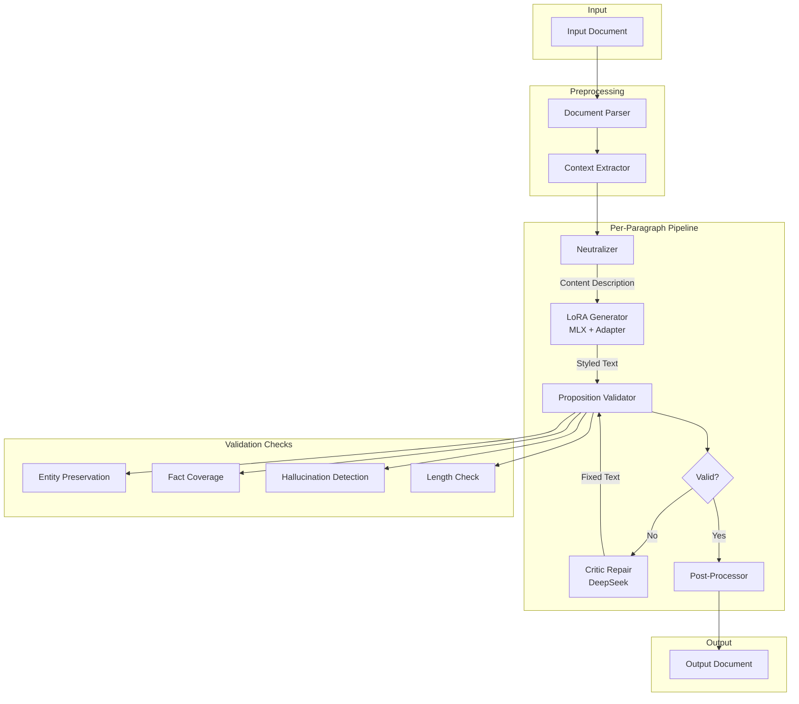
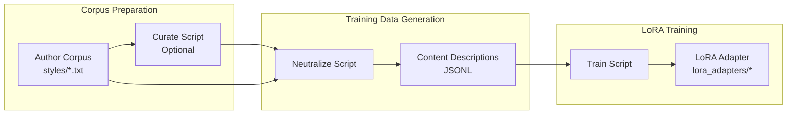
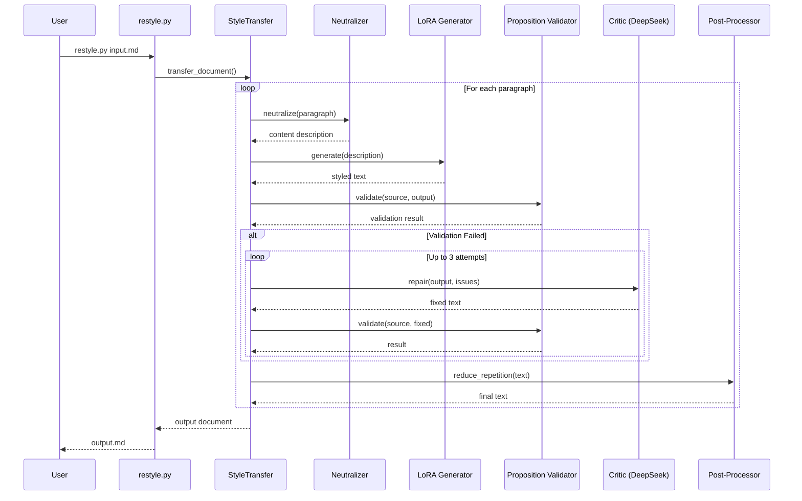

# Text Style Transfer

Transform text to match a target author's writing style while preserving semantic meaning. Uses LoRA-adapted language models for fast, consistent style transfer with a critic/repair loop to ensure content fidelity.

## Features

- **LoRA-Based Generation**: Fine-tuned adapters capture author style in model weights
- **Critic/Repair Loop**: DeepSeek validates content preservation and fixes issues
- **Proposition Validation**: Ensures all facts, entities, and examples are preserved
- **Hallucination Detection**: Identifies and removes invented content
- **Perspective Control**: Transform to first/third person while maintaining style
- **Fast Transfer**: ~15-30 seconds per paragraph
- **Configurable**: All parameters tunable via config file

## Requirements

- Python 3.9+
- Apple Silicon Mac (for MLX-based training/inference)
- ~18GB RAM for inference, ~50GB for training
- DeepSeek API key (for critic/repair loop)

## Installation

```bash
# Clone repository
git clone <repository-url>
cd text-style-transfer

# Create virtual environment
python3 -m venv venv
source venv/bin/activate

# Install dependencies
pip install -r requirements.txt

# Download spaCy model
python -m spacy download en_core_web_sm
```

## Quick Start

### 1. Configure

Copy `config.json.sample` to `config.json` and add your DeepSeek API key:

```bash
cp config.json.sample config.json
# Edit config.json to add your API key
```

### 2. Train a LoRA Adapter

```bash
# Step 1: Generate training data (instruction back-translation)
python scripts/neutralize_corpus.py \
    --input styles/sample_author.txt \
    --output data/neutralized/author.jsonl \
    --author "Author Name"

# Step 2: Train LoRA adapter
python scripts/train_mlx_lora.py \
    --from-neutralized data/neutralized/author.jsonl \
    --author "Author Name" \
    --train \
    --output lora_adapters/author
```

### 3. Transfer Text

```bash
python restyle.py input.md -o output.md \
    --adapter lora_adapters/author \
    --author "Author Name"
```

---

## Creating LoRA Adapters

### Step 1: Prepare Your Corpus

Create a plain text file with the author's writing:

| Requirement | Recommendation |
|-------------|----------------|
| **Size** | 50KB-500KB (0.9M tokens optimal) |
| **Format** | Clean paragraphs separated by blank lines |
| **Content** | Representative prose samples |
| **Remove** | Headers, footnotes, citations, non-prose content |

Place your corpus in `styles/` directory:
```bash
styles/sample_author.txt
```

For large corpuses, curate to optimal size first:
```bash
python scripts/curate_corpus.py \
    --input styles/author_full.txt \
    --output styles/author.txt \
    --target-tokens 900000
```

### Step 2: Generate Training Data

The neutralization step creates training pairs using instruction back-translation:

```bash
python scripts/neutralize_corpus.py \
    --input styles/sample_author.txt \
    --output data/neutralized/author.jsonl \
    --author "Author Name"
```

**Options:**

| Option | Default | Description |
|--------|---------|-------------|
| `--min-words` | 250 | Minimum words per training chunk |
| `--max-words` | 650 | Maximum words per training chunk |
| `--workers` | 1 | Parallel workers (Ollama only) |
| `--llm` | mlx | LLM provider (`mlx` or `ollama:model`) |

**What happens:** Each paragraph is converted to a neutral content description. The model learns: "given this description → produce this styled text."

### Step 3: Train the LoRA Adapter

```bash
python scripts/train_mlx_lora.py \
    --from-neutralized data/neutralized/author.jsonl \
    --author "Author Name" \
    --train \
    --output lora_adapters/author
```

**Options:**

| Option | Default | Description |
|--------|---------|-------------|
| `--epochs` | 1 | Training epochs (1 is often sufficient) |
| `--batch-size` | 1 | Batch size (reduce if OOM) |
| `--learning-rate` | 1e-4 | Learning rate |
| `--rank` | 16 | LoRA rank (higher = more capacity) |
| `--alpha` | 32 | LoRA alpha scaling |
| `--resume` | - | Resume from last checkpoint |

**Training time:** ~15-30 minutes for a typical corpus.

### Step 4: Verify Your Adapter

List available adapters:
```bash
python restyle.py --list-adapters
```

Test with a sample:
```bash
python restyle.py test.txt -o output.txt \
    --adapter lora_adapters/author \
    -v
```

---

## Style Transfer

### Basic Usage

```bash
python restyle.py <input> -o <output> --adapter <path>
```

### CLI Options

| Option | Description |
|--------|-------------|
| `--adapter PATH` | Path to LoRA adapter directory (required) |
| `--author NAME` | Author name used in generation prompts (e.g., "You are {author}"). Auto-detected from adapter metadata if not provided |
| `--temperature FLOAT` | Generation temperature (default: 0.7) |
| `--perspective` | Output perspective (see below) |
| `--no-verify` | Disable entailment verification |
| `-c, --config PATH` | Config file path (default: config.json) |
| `-v, --verbose` | Verbose output with per-paragraph details |
| `--list-adapters` | List available adapters and exit |

### Perspective Options

Control the output perspective with `--perspective`:

| Value | Description |
|-------|-------------|
| `preserve` | Keep source text's perspective (default) |
| `first_person_singular` | Write in first person (I, me, my) |
| `first_person_plural` | Write in first person plural (we, us, our) |
| `third_person` | Write in third person (he, she, they) |
| `author_voice_third_person` | Write AS the author using third person |

**Example:**
```bash
python restyle.py input.md -o output.md \
    --adapter lora_adapters/sagan \
    --perspective first_person_singular
```

### Streaming Output

Output is written incrementally as each paragraph completes. If interrupted with Ctrl+C, partial results are saved.

---

## Configuration Reference

All settings are in `config.json`. Copy from `config.json.sample` to get started.

### LLM Providers

```json
{
  "llm": {
    "provider": {
      "writer": "mlx",
      "critic": "deepseek"
    },
    "providers": {
      "deepseek": {
        "api_key": "${DEEPSEEK_API_KEY}",
        "base_url": "https://api.deepseek.com",
        "model": "deepseek-chat",
        "max_tokens": 4096,
        "temperature": 0.7
      },
      "mlx": {
        "model": "mlx-community/Qwen3-8B-4bit",
        "max_tokens": 512,
        "temperature": 0.7
      }
    }
  }
}
```

### Generation Settings

```json
{
  "generation": {
    // Repair settings
    "max_repair_attempts": 3,
    "repair_temperature": 0.3,

    // Meaning preservation (0.0-1.0, higher = stricter)
    "entailment_threshold": 0.7,
    "proposition_threshold": 0.7,
    "anchor_threshold": 0.8,

    // Length control
    "max_expansion_ratio": 1.5,
    "target_expansion_ratio": 1.2,
    "truncate_over_expanded": false,

    // LoRA influence (0.0=base only, 1.0=full, >1.0=amplified)
    "lora_scale": 1.0,

    // Style settings
    "style_temperature": 0.7,
    "neutralization_temperature": 0.3,
    "use_neutralization": true,

    // Neutralization token limits
    "neutralization_min_tokens": 300,
    "neutralization_token_multiplier": 1.2,

    // Content anchor detection
    "analogy_min_length": 10,
    "detect_phase_transitions": true,

    // Hallucination detection
    "hallucination_check_noun_phrases": true,
    "critical_hallucination_words": "death,god,soul,spirit,heaven,hell,divine,eternal",

    // Post-processing
    "repetition_threshold": 3,
    "reduce_repetition": true,

    // Document handling
    "use_document_context": true,
    "pass_headings_unchanged": true,
    "min_paragraph_words": 10
  }
}
```

### Style Settings

```json
{
  "style": {
    "perspective": "preserve"
  }
}
```

### Key Configuration Options Explained

| Option | Default | Use Case |
|--------|---------|----------|
| `lora_scale` | 1.0 | **Lower (0.5-0.8)**: Subtler style, more base model. **Higher (1.2-1.5)**: Stronger style influence |
| `proposition_threshold` | 0.85 | **Higher (0.9+)**: Maximum accuracy, may need more repairs. **Lower (0.7)**: Faster, allows some loss |
| `anchor_threshold` | 0.9 | **Higher**: Strict entity/example preservation. **Lower**: More flexibility |
| `max_expansion_ratio` | 1.5 | Maximum output length relative to input (1.5 = 50% longer max) |
| `max_repair_attempts` | 3 | More attempts = better content preservation, slower processing |
| `style_temperature` | 0.7 | **Higher**: More creative/varied. **Lower**: More consistent/predictable |
| `critical_hallucination_words` | ... | Comma-separated words that trigger critical hallucination alerts |

---

## Customizing Prompts

All prompts are in the `prompts/` directory as editable text files:

| File | Purpose |
|------|---------|
| `style_transfer_system.txt` | Main system prompt for LoRA generation |
| `neutralize_for_transfer.txt` | Converts prose to neutral descriptions |
| `critic_repair_system.txt` | System prompt for critic repairs |
| `critic_repair_user.txt` | User prompt template for repairs |

Prompts use `{variable}` syntax. Available variables depend on the prompt.

---

## Project Architecture

The system implements a multi-stage pipeline for style transfer:

### Core Pipeline Flow

1. **Document Parsing**: Split input into paragraphs, extract document context
2. **Neutralization**: Convert each paragraph to a content description (removes original style)
3. **LoRA Generation**: Generate styled text from description using fine-tuned adapter
4. **Proposition Validation**: Check all facts, entities, and examples are preserved
5. **Critic Repair**: Fix missing content, remove hallucinations (up to 3 attempts)
6. **Post-Processing**: Reduce repetition, remove LLM-speak patterns

### Module Overview

```
src/
├── config.py                 # Configuration loading and validation
├── generation/
│   ├── transfer.py           # Main pipeline orchestration (StyleTransfer class)
│   └── lora_generator.py     # MLX LoRA inference (LoRAStyleGenerator class)
├── validation/
│   ├── proposition_validator.py  # Fact/entity preservation checking
│   ├── semantic_verifier.py      # Semantic fidelity verification
│   └── quality_critic.py         # Quality issue detection
├── ingestion/
│   └── proposition_extractor.py  # Extract propositions, entities, anchors
├── vocabulary/
│   └── repetition_reducer.py     # Post-processing for word variety
├── llm/
│   ├── deepseek.py           # DeepSeek API provider
│   ├── mlx_provider.py       # MLX local inference
│   └── ollama.py             # Ollama provider
└── utils/
    ├── nlp.py                # spaCy NLP utilities
    └── prompts.py            # Prompt loading/formatting
```

### Key Classes

| Class | File | Purpose |
|-------|------|---------|
| `StyleTransfer` | `generation/transfer.py` | Main pipeline orchestrator |
| `LoRAStyleGenerator` | `generation/lora_generator.py` | MLX-based LoRA inference |
| `PropositionValidator` | `validation/proposition_validator.py` | Content preservation checking |
| `PropositionExtractor` | `ingestion/proposition_extractor.py` | Extract facts and entities |
| `RepetitionReducer` | `vocabulary/repetition_reducer.py` | Post-processing |

### Data Flow Diagram



### Training Data Flow



### Inference Flow Detail



---

## Performance

| Metric | Value |
|--------|-------|
| Time per paragraph | 15-30 seconds |
| Memory (inference, 4-bit) | ~8GB |
| Memory (training, bf16) | ~50GB |
| Training data generation | ~30-60 min per corpus |
| Training time | ~15-30 min |

---

## Troubleshooting

### MLX Not Available

This project requires Apple Silicon. For other platforms, use Ollama as the LLM provider.

### Out of Memory During Training

Use 4-bit model:
```json
"mlx": {
  "model": "mlx-community/Qwen3-8B-4bit"
}
```

Or reduce batch size:
```bash
python scripts/train_mlx_lora.py --train ... --batch-size 1
```

### Missing DeepSeek API Key

Set in config.json or as environment variable:
```bash
export DEEPSEEK_API_KEY="your-key"
```

### Resume Interrupted Training

```bash
python scripts/train_mlx_lora.py \
    --from-neutralized data/neutralized/author.jsonl \
    --train \
    --output lora_adapters/author \
    --resume
```

### spaCy Model Missing

```bash
python -m spacy download en_core_web_sm
```

### Style Too Weak

Increase `lora_scale` in config.json:
```json
{
  "generation": {
    "lora_scale": 1.3
  }
}
```

### Content Being Lost

The default thresholds (0.85/0.9) are tuned for accuracy. For maximum preservation:
```json
{
  "generation": {
    "proposition_threshold": 0.95,
    "anchor_threshold": 0.95,
    "max_repair_attempts": 5
  }
}
```

---

## Running Tests

```bash
# Run all tests
python -m pytest tests/ -v

# Run with coverage
python -m pytest tests/ --cov=src --cov-report=term-missing

# Run specific test file
python -m pytest tests/unit/test_proposition_extractor.py -v
```

---

## License

MIT License - See LICENSE file for details.
