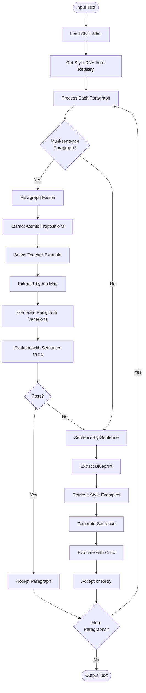

# Text Style Transfer

Transform text to match a target author's style while preserving semantic meaning. Uses a Style Atlas architecture with RAG-based retrieval, paragraph fusion, and semantic validation.

## Dependencies

This project requires the following Python packages (see `requirements.txt` for versions):
- **spacy** - Natural language processing and grammatical validation
- **nltk** - Text tokenization and linguistic analysis
- **numpy** - Numerical computations
- **scikit-learn** - Machine learning (K-means clustering for style atlas)
- **sentence-transformers** - Semantic embeddings and similarity calculations
- **torch** - PyTorch (required by sentence-transformers for neural network operations)
- **requests** - HTTP requests for LLM API calls
- **chromadb** - Vector database for style atlas storage
- **pytest** - Testing framework

Additional setup required:
- **spaCy English model**: `en_core_web_sm` (download with `python3 -m spacy download en_core_web_sm`)
- **NLTK data**: punkt, punkt_tab, averaged_perceptron_tagger_eng, vader_lexicon (downloaded automatically or manually)

## Quick Start

### Installation

```bash
# Create virtual environment
python3 -m venv venv
source venv/bin/activate  # On Windows: venv\Scripts\activate

# Install dependencies
pip install -r requirements.txt

# Download NLTK data (automatic on first run, or manually):
python3 -c "import nltk; nltk.download('punkt', quiet=True); nltk.download('punkt_tab', quiet=True); nltk.download('averaged_perceptron_tagger_eng', quiet=True); nltk.download('vader_lexicon', quiet=True)"

# Download spaCy model (required for grammatical validation):
python3 -m spacy download en_core_web_sm
```

### Configuration

1. Copy `config.json` and set your API key:
   ```json
   {
     "provider": "deepseek",
     "deepseek": {
       "api_key": "your-api-key-here"
     },
     "blend": {
       "authors": ["Mao"]
     }
   }
   ```

2. Load author styles into ChromaDB:
   ```bash
   python3 scripts/load_style.py --style-file styles/sample_mao.txt --author "Mao"
   ```

3. Transform text:
   ```bash
   python3 restyle.py input/small.md -o output/small.md
   ```

## Usage

### Loading Author Styles

Load author styles into ChromaDB using `scripts/load_style.py`:

```bash
# Single author
python3 scripts/load_style.py --style-file styles/sample_mao.txt --author "Mao"

# Multiple authors
python3 scripts/load_style.py \
  --style-file styles/sample_hemingway.txt --author "Hemingway" \
  --style-file styles/sample_lovecraft.txt --author "Lovecraft"
```

### Transforming Text

```bash
# Basic usage
python3 restyle.py input/small.md -o output/small.md

# With options
python3 restyle.py input/small.md -o output/small.md \
  --max-retries 5 \
  --verbose
```

**CLI Options:**
- `input`: Input text file (required)
- `-o, --output`: Output file path (required)
- `-c, --config`: Config file path (default: `config.json`)
- `--max-retries`: Max retry attempts per sentence (default: 3)
- `--atlas-cache`: ChromaDB persistence directory (overrides config)
- `-v, --verbose`: Enable verbose output

### Python API

```python
from src.pipeline import run_pipeline

output = run_pipeline(
    input_file="input/small.md",
    output_file="output/small.md",
    config_path="config.json",
    verbose=True
)
```

## Configuration

### Provider Settings

```json
{
  "provider": "deepseek",
  "deepseek": {
    "api_key": "your-api-key-here",
    "api_url": "https://api.deepseek.com/v1/chat/completions",
    "editor_model": "deepseek-chat",
    "critic_model": "deepseek-chat"
  }
}
```

Supported providers: `deepseek`, `ollama`, `glm`, `gemini`

### Author Configuration

```json
{
  "blend": {
    "authors": ["Mao"]
  }
}
```

The first author in the list is used. Style DNA is loaded from the Style Registry (`atlas_cache/author_profiles.json`).

### Key Configuration Sections

**Paragraph Fusion** (paragraph-level generation):
```json
{
  "paragraph_fusion": {
    "enabled": true,
    "min_sentences_for_fusion": 2,
    "min_sentence_ratio": 0.6,
    "style_lexicon_ratio": 0.1,
    "transcribe_headings_as_is": true,
    "use_structural_templates": false,
    "proposition_recall_threshold": 0.85,
    "min_viable_recall_threshold": 0.70,
    "style_alignment_weight": 0.2,
    "meaning_weight": 0.9,
    "complexity_filter_min_length": 10,
    "min_word_count": 10,
    "min_sentence_count": 2,
    "num_style_examples": 50,
    "num_variations": 20,
    "retrieval_pool_size": 50,
    "structure_diversity": {
      "enabled": true,
      "count_match_weight": 0.7,
      "diversity_weight": 0.4,
      "positional_weight": 0.8,
      "freshness_weight": 2.0,
      "opener_penalty_threshold": 0.3,
      "similarity_threshold": 0.7
    }
  }
}
```

Key options:
- `use_structural_templates` (default: `false`): When enabled, "bleaches" style examples by replacing content words with placeholders (`[NP]`, `[VP]`, `[ADJ]`, `[ADV]`) while preserving functional words and syntax. This prevents domain-specific vocabulary from leaking into narrative generation.
- `transcribe_headings_as_is` (default: `true`): Detects and transcribes single-sentence paragraphs that look like headings without restyling.
- `min_sentence_ratio` (default: `0.6`): Minimum ratio of sentences in teacher example relative to target sentence count.
- `style_lexicon_ratio` (default: `0.1`): Ratio of style lexicon words to include in mandatory vocabulary.
- `structure_diversity`: Controls how diverse structural templates are selected (sentence count matching, positional variety, freshness).

**Semantic Critic** (validation thresholds and scoring weights):
```json
{
  "semantic_critic": {
    "recall_threshold": 0.85,
    "precision_threshold": 0.60,
    "similarity_threshold": 0.7,
    "fluency_threshold": 0.8,
    "weights": {
      "accuracy": 0.5,
      "fluency": 0.1,
      "style": 0.1,
      "thesis_alignment": 0.15,
      "intent_compliance": 0.1,
      "keyword_coverage": 0.05
    }
  }
}
```

The `weights` section controls how different metrics contribute to the composite score:
- `accuracy`: Semantic accuracy (proposition recall/precision)
- `fluency`: Grammatical fluency
- `style`: Style alignment with target author
- `thesis_alignment`: Alignment with document thesis (when global context is available)
- `intent_compliance`: Compliance with document intent (when global context is available)
- `keyword_coverage`: Coverage of document keywords (when global context is available)

**Atlas** (Style Atlas settings):
```json
{
  "atlas": {
    "persist_path": "atlas_cache/",
    "num_clusters": 5,
    "min_structure_words": 4,
    "max_length_ratio": 1.8,
    "min_length_ratio": 0.6
  }
}
```

**Translator** (generation parameters):
```json
{
  "translator": {
    "temperature": 0.5,
    "max_tokens": 300
  }
}
```

**Critic** (evaluation settings):
```json
{
  "critic": {
    "min_score": 0.6,
    "max_retries": 5,
    "good_enough_threshold": 0.8
  }
}
```

**Global Context** (document-level context for style transfer):
```json
{
  "global_context": {
    "enabled": true,
    "max_summary_tokens": 500
  }
}
```

When enabled, the system uses document-level context (thesis, intent, keywords) to improve style transfer quality. This is particularly useful for maintaining consistency across long documents.

**Evolutionary** (evolutionary generation parameters):
```json
{
  "evolutionary": {
    "batch_size": 40,
    "variants_per_skeleton": {
      "strict_adherence": 10,
      "high_style": 10,
      "experimental": 10,
      "simplified": 10
    },
    "max_generations": 3,
    "convergence_threshold": 0.95,
    "top_k_parents": 10,
    "breeding_children": 10,
    "min_keyword_presence": 0.5
  }
}
```

Controls the evolutionary generation process for sentence-level style transfer.

## Project Structure

```
text-style-transfer/
├── src/
│   ├── pipeline.py              # Main pipeline orchestration
│   ├── atlas/
│   │   ├── builder.py          # Style Atlas construction
│   │   ├── navigator.py        # RAG retrieval
│   │   └── style_registry.py   # Style DNA storage
│   ├── generator/
│   │   ├── translator.py       # Text generation
│   │   └── mutation_operators.py # Prompt templates
│   ├── validator/
│   │   └── semantic_critic.py  # Validation
│   ├── analyzer/
│   │   ├── style_extractor.py  # Style DNA extraction
│   │   ├── structuralizer.py   # Rhythm extraction
│   │   └── structure_extractor.py # Structural template extraction
│   └── analysis/
│       └── semantic_analyzer.py # Proposition extraction
├── prompts/                     # LLM prompt templates (markdown)
├── scripts/
│   ├── load_style.py           # Load author styles
│   ├── list_styles.py          # List loaded authors
│   └── clear_chromadb.py       # Clear ChromaDB
├── config.json                 # Configuration
└── restyle.py                  # CLI entry point
```

## How It Works

### Pipeline Flow



### Key Components

1. **Style Atlas**: ChromaDB-based vector store with dual embeddings (semantic + style) and K-means clustering
2. **Paragraph Fusion**: For multi-sentence paragraphs, extracts atomic propositions and generates cohesive paragraphs matching human rhythm patterns
3. **Structural Cloning**: Extracts sentence rhythm (length, type, opener) from examples and forces LLM to match it exactly
4. **Semantic Critic**: Validates generated text using proposition recall and style alignment metrics
5. **Style Registry**: Sidecar JSON storage for author Style DNA profiles

### Paragraph Fusion Process

1. Extract atomic propositions from input paragraph
2. Retrieve complex style examples from atlas
3. Select "teacher example" with sentence count matching `ceil(n_props * min_sentence_ratio)`
4. If `use_structural_templates` is enabled, "bleach" the teacher example by replacing content words with placeholders (`[NP]`, `[VP]`, `[ADJ]`, `[ADV]`) while preserving functional words
5. Extract rhythm map (sentence length, type, opener) from teacher
6. Generate variations using structural blueprint (or structural template if enabled)
7. Evaluate with semantic critic (proposition recall + style alignment + context metrics)
8. Select best candidate or trigger repair loop if recall is low

### Sentence-by-Sentence Fallback

If paragraph fusion fails or is disabled:
1. Extract semantic blueprint (SVO triples, entities, keywords)
2. Classify rhetorical type (observation, argument, etc.)
3. Retrieve style examples by rhetorical type
4. Generate sentence with style constraints
5. Evaluate and refine iteratively

## Testing

Run tests:
```bash
# Activate virtual environment first
source venv/bin/activate  # On Windows: venv\Scripts\activate

# Run individual test files
python3 tests/test_paragraph_rhythm_extraction.py
python3 tests/test_translate_paragraph_contract.py
python3 tests/test_pipeline_fallback_contract.py
python3 tests/test_quality_improvements.py

# Or run all tests with pytest
pytest tests/
```

## Troubleshooting

**Atlas not found**: Load styles first using `scripts/load_style.py`

**Author not found**: Check `blend.authors` in config.json matches loaded author names

**Low quality output**: Adjust `paragraph_fusion.proposition_recall_threshold` or `semantic_critic.recall_threshold`

**Import errors**: Ensure virtual environment is activated and dependencies are installed

**Missing spaCy model**: Run `python3 -m spacy download en_core_web_sm` to download the English model

**Missing NLTK data**: The code will attempt to download required NLTK data automatically, but you can also download manually using the command in the Installation section
