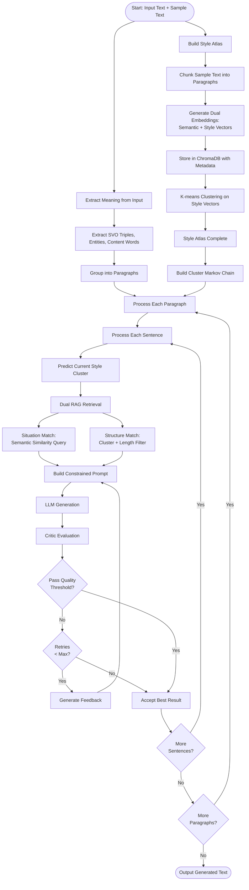

# Text Style Transfer Pipeline

A sophisticated text style transfer system that transforms input text to match the style of a sample text while preserving semantic meaning. The pipeline uses a **Style Atlas** architecture with RAG-based dual retrieval, combining semantic embeddings, style clustering, and LLM-based generation with adversarial validation.

## Overview

The system implements a **Style Atlas Pipeline** with the following components:

- **Style Atlas Builder**: Builds a dual-vector index (semantic + style) from sample text using ChromaDB
- **Style Navigator**: Uses Markov chains to predict style cluster transitions and retrieves relevant references
- **Dual RAG Retrieval**:
  - **Situation Match**: Finds semantically similar paragraphs for vocabulary grounding
  - **Structure Match**: Finds paragraphs matching target style cluster with length constraints
- **Prompt Assembler**: Constructs constrained prompts that separate vocabulary and structure guidance
- **Adversarial Critic**: LLM-based evaluator that provides feedback for iterative refinement

## Installation

### Prerequisites

- Python 3.12 or higher (required for ChromaDB compatibility)
- pip (Python package manager)

### Setup

1. Clone or navigate to the project directory:
```bash
cd text-style-transfer
```

2. Create a virtual environment:
```bash
python3 -m venv venv
source venv/bin/activate  # On Windows: venv\Scripts\activate
```

3. Install dependencies:
```bash
pip install -r requirements.txt
```

4. Download required NLTK data (done automatically on first run, but can be done manually):
```bash
python3 -c "import nltk; nltk.download('punkt_tab'); nltk.download('stopwords'); nltk.download('averaged_perceptron_tagger_eng')"
```

5. Download spaCy model (optional, for better dependency parsing):
```bash
python3 -m spacy download en_core_web_sm
```

## Configuration

The project uses `config.json` for configuration. Here's the structure:

```json
{
  "provider": "deepseek",
  "deepseek": {
    "api_key": "your-api-key-here",
    "api_url": "https://api.deepseek.com/v1/chat/completions",
    "editor_model": "deepseek-chat",
    "critic_model": "deepseek-chat"
  },
  "sample": {
    "file": "prompts/sample_mao.txt"
  },
  "atlas": {
    "persist_path": "atlas_cache/",
    "num_clusters": 5
  }
}
```

### Configuration Options

- **provider**: LLM provider to use (`"deepseek"` or `"ollama"`)
- **deepseek.api_key**: Your DeepSeek API key (get one at https://platform.deepseek.com)
- **deepseek.api_url**: DeepSeek API endpoint (usually the default)
- **deepseek.editor_model**: Model for text generation (default: `"deepseek-chat"`)
- **deepseek.critic_model**: Model for critic evaluation (default: `"deepseek-chat"`)
- **sample.file**: Path to the sample text file that defines the target style
- **atlas.persist_path**: Directory to cache/load Style Atlas (optional)
- **atlas.num_clusters**: Number of K-means clusters for style grouping (default: 5)

### Getting an API Key

1. Sign up at https://platform.deepseek.com
2. Navigate to API keys section
3. Create a new API key
4. Copy the key and paste it into `config.json`

## Usage

### Command Line Interface (Recommended)

Use the main CLI entry point:

```bash
source venv/bin/activate
python3 restyle.py input/small.md -o output/small.md
```

With additional options:

```bash
# Specify a custom sample file
python3 restyle.py input/small.md -o output/small.md --sample prompts/custom_sample.txt

# Cache the Style Atlas for faster subsequent runs
python3 restyle.py input/small.md -o output/small.md --atlas-cache atlas_data/

# Adjust retry settings
python3 restyle.py input/small.md -o output/small.md --max-retries 5

# Enable verbose output
python3 restyle.py input/small.md -o output/small.md -v
```

### CLI Options

- `input`: Input text file to transform (required)
- `-o, --output`: Output file path (required)
- `-s, --sample`: Sample text file defining target style (optional, uses config.json default)
- `-c, --config`: Configuration file path (default: `config.json`)
- `--max-retries`: Maximum retry attempts per sentence (default: 3)
- `--atlas-cache`: Path to directory for persisting/loading Style Atlas (optional)
- `-v, --verbose`: Enable verbose output

### Python API

Use the Python API directly:

```python
from src.pipeline import run_pipeline, process_text

# Using file paths
output = run_pipeline(
    input_file="input/small.md",
    output_file="output/small.md",
    atlas_persist_path="atlas_cache/"
)

# Using text directly
input_text = "Your input text here."
sample_text = "Your style sample text here."
output = process_text(
    input_text=input_text,
    sample_text=sample_text,
    config_path="config.json",
    atlas_cache_path="atlas_cache/"
)
```

## Project Structure

```
text-style-transfer/
├── src/
│   ├── models.py              # Data structures (ContentUnit)
│   ├── analyzer/
│   │   ├── style_metrics.py   # Style vector extraction
│   │   └── structure.py        # Sentence type classification
│   ├── atlas/
│   │   ├── builder.py         # Style Atlas construction
│   │   └── navigator.py       # Cluster navigation and RAG retrieval
│   ├── ingestion/
│   │   └── semantic.py        # Semantic meaning extraction
│   ├── generator/
│   │   ├── llm_interface.py   # LLM generation
│   │   └── prompt_builder.py  # RAG-based prompt assembly
│   ├── validator/
│   │   └── critic.py          # Adversarial critic evaluation
│   └── pipeline.py            # Main pipeline orchestration
├── tests/                      # Test files
├── input/                      # Input text files
├── output/                     # Generated output files
├── prompts/                    # Sample style files
├── config.json                 # Configuration file
├── requirements.txt            # Python dependencies
└── restyle.py                 # CLI entry point
```

## How It Works

The following diagram illustrates the complete pipeline flow:



1. **Style Atlas Construction**:
   - Chunks sample text into paragraphs
   - Generates dual embeddings: semantic (sentence-transformers) and style (deterministic metrics)
   - Stores in ChromaDB with metadata (word count, sentence count, cluster ID)
   - Runs K-means clustering on style vectors to group paragraphs into style clusters

2. **Meaning Extraction**: Parses input text to extract:
   - Subject-Verb-Object triples
   - Named entities
   - Content words
   - Paragraph and sentence position metadata

3. **Style Navigation**:
   - Builds Markov chain from cluster sequence in sample text
   - Predicts next style cluster based on current generated text
   - Determines appropriate style state for each input segment

4. **Dual RAG Retrieval**:
   - **Situation Match**: Queries ChromaDB by semantic similarity to find paragraphs about similar topics (vocabulary grounding)
   - **Structure Match**: Queries ChromaDB by cluster ID and filters by length ratio (0.7x-1.5x) to find rhythm/structure examples

5. **Constrained Generation**: Uses LLM with RAG-based prompts that:
   - Explicitly separate vocabulary guidance (from situation match) and structure guidance (from structure match)
   - Include length constraints to prevent expansion (1:1 sentence mapping)
   - Prohibit "AI slop" words and hallucination

6. **Adversarial Validation**:
   - Critic LLM evaluates generated text against both structure and situation matches
   - Provides specific feedback on vocabulary and structure mismatches
   - Retries up to 3 times with feedback until quality threshold is met

## Testing

Run all tests:

```bash
source venv/bin/activate
python3 tests/test_models.py
python3 tests/test_atlas.py
python3 tests/test_semantic.py
python3 tests/test_llm_interface.py
python3 tests/test_validator.py
```

Or run them all at once:

```bash
source venv/bin/activate
for test in tests/test_*.py; do python3 "$test"; done
```

Note: Some tests require a valid API key in `config.json` and will be skipped if unavailable.

## Dependencies

- **nltk**: Natural language processing and tokenization
- **numpy**: Numerical computations
- **scikit-learn**: K-means clustering and machine learning utilities
- **sentence-transformers**: Semantic embeddings
- **chromadb**: Vector database for RAG retrieval
- **spacy**: Dependency parsing (optional, with fallback)
- **requests**: HTTP requests for API calls
- **pydantic-settings**: Configuration management

See `requirements.txt` for complete list and versions.

## Troubleshooting

### API Key Issues

If you see API errors:
1. Verify your API key in `config.json`
2. Check that you have sufficient API credits
3. Ensure the API endpoint URL is correct

### NLTK Data Missing

If you see NLTK resource errors:
```bash
python3 -c "import nltk; nltk.download('punkt_tab'); nltk.download('stopwords'); nltk.download('averaged_perceptron_tagger_eng')"
```

### ChromaDB Issues

If you see ChromaDB errors:
- Ensure Python 3.12+ is being used (required for ChromaDB compatibility)
- Try rebuilding the virtual environment: `python3.12 -m venv venv`
- Check that `onnxruntime` is installed (required dependency)

### Import Errors

Make sure you're running from the project root directory and the virtual environment is activated.

### Low Quality Output

The pipeline includes retry mechanisms, but if output quality is consistently low:
- Try a longer or more representative sample text
- Increase `max_retries` (default: 3)
- Ensure the sample text has sufficient variety in style
- Check that the Style Atlas is being built correctly (check logs)

### Length Expansion Issues

If output is much longer than input:
- The length-constrained retrieval should prevent this
- Check that the atlas was built with length metadata (rebuild if needed)
- Verify that structure matches are being filtered by length ratio

## License

[Add your license here]

## Contributing

[Add contribution guidelines here]
